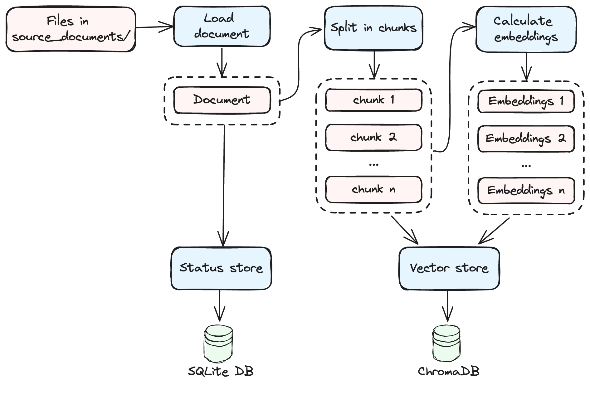
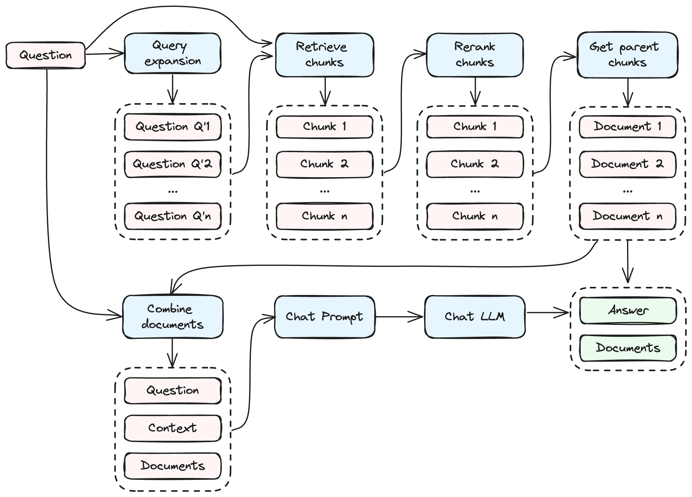
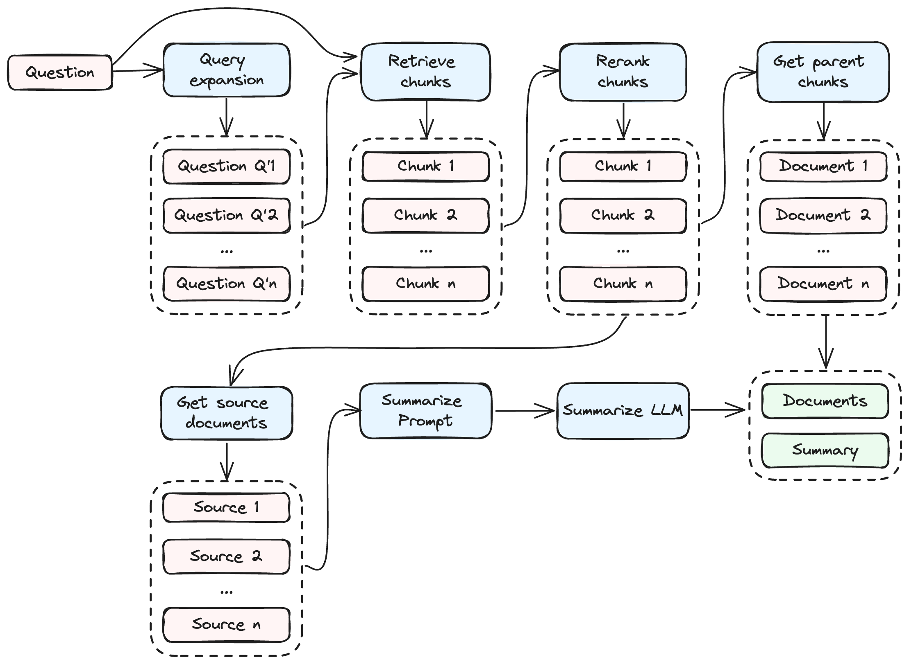

# Chatnerd

Yet another CLI tool to Q&A with your privatedocuments using local LLMs and RAG (Retrieval-augmented generation) techniques. This is my personal project to learn about LLMs and RAGs.

## Introduction

Welcome to Chatnerd, a command-line interface (CLI) application to interact with private documents, YouTube videos, and podcasts using local language models (LLMs) and retrieval-augmented generation (RAG) techniques. The application allows you to create and interact with "nerds", each designed as an expert in a particular area of knowledge, with its own configuration and set of documents.

You can create multiple nerds to cover a wide range of topics and activate one at a time to talk about that specific area. 

## How to install?

- Requires python >=3.10
- Create an environment (recommended)
- Install package and CLI app:
```bash
pip install git+https://github.com/raulonlab/chatnerd.git
```

Or clone the repo and install it in development mode using poetry:
```bash
git clone https://github.com/raulonlab/chatnerd.git
poetry install
poetry shell
```

## How to Use?

```bash
chatnerd --help
```

```
Usage: chatnerd [OPTIONS] COMMAND [ARGS]...                             
                                                                         
╭─ Options ─────────────────────────────────────────────────────────────╮
│ --install-completion          Install completion for the current      │
│                               shell.                                  │
│ --show-completion             Show completion for the current shell,  │
│                               to copy it or customize the             │
│                               installation.                           │
│ --help                        Show this message and exit.             │
╰───────────────────────────────────────────────────────────────────────╯
╭─ Commands ────────────────────────────────────────────────────────────╮
│ study      Start studying documents (embed and store documents in     │
│            vector DB)                                                 │
│ chat       Start a chat session with your active nerd                 │
│ retrieve   Retrieve relevant documents of a query and optionally      │
│            generate a summary of the documents.                       │
│ review     Append a review value to the last chat log                 │
│ env        Print the current value of environment variables           │
│ config     Print the active nerd configuration (chatnerd.config.yml)  │
│ project    Manage projects: create, activate, deactivate, list and    │
│            remove                                                     │
│ db         View and manage the local DBs                              │
╰───────────────────────────────────────────────────────────────────────╯

```

### Create and manage nerds

Create a new nerd:
```bash
chatnerd init project_name
```
> The first time, it will create a new directory `nerds` in the current path to store the nerds data.

The following files will be created in the nerds folder:

```
📁 nerds/
├─ 📁 project_name/
│  ├─ 📁 .nerd_store/            # stores data files (status and vector DBs)
│  ├─ 📁 chatnerd_documents/     # source documents to ingest (pdf, txt, etc)
│  ├─ 📄 chatnerd.models.yml     # Additional LLM presets
│  ├─ 📄 chatnerd.prompts.yml    # Customized prompts
│  ├─ 📄 chatnerd.config.yml     # Customized configuration
```

Activate a nerd:
```bash
chatnerd activate project_name
```

This writes the environment variable `ACTIVE_PROJECT=project_name` in the file `.chatnerd.env` which is loaded by the application when it runs. 

You can also `list`, `rename` and `remove` nerds.

### Add sources

Nerds can ingest information from these 3 sources:

- **Document files in the directory `source_documents/`**. The supported formats with the loader class (from Langchain) used are the following:
  - `".pdf"`: PDFMinerLoader,
  - `".epub"`: UnstructuredEPubLoader,
  - `".md"`: UnstructuredMarkdownLoader,
  - `".txt"`: TextLoader,
  - `".doc"`: UnstructuredWordDocumentLoader,
  - `".docx"`: UnstructuredWordDocumentLoader,
  - `".enex"`: EverNoteLoader,
  - `".csv"`: CSVLoader,
  - `".html"`: UnstructuredHTMLLoader,
  - `".odt"`: UnstructuredODTLoader,
  - `".ppt"`: UnstructuredPowerPointLoader,
  - `".pptx"`: UnstructuredPowerPointLoader,

- **Youtube URLs in the file `youtube.sources`**: Links to videos, playlists and channels are supported. One url per line. Lines starting with `#` are ignored.
- **Podcast URLs in the file `podcast.sources`**: Links to XML feeds are supported. One url per line. Lines starting with `#` are ignored.

For the Youtube and podcast sources it's necessary to download the audio and transcribe the audio into text files in order to be ready to ingest.

### Download and transcribe Youtube and podcast sources


Start downloading the audio files (.mp3) of the youtube and podcast sources:
```bash
chatnerd download-sources
```
> Audio files are saved in `downloads/youtube/` and `downloads/podcasts/` organised by channel / author name

Start transcribing the audio files from the downloads directory into transcript files (.transcript):
```bash
chatnerd transcribe-downloads
```
> Transcript files are saved in `source_documents/youtube/` and `source_documents/podcasts/` with the same directory structure than audio files in the downloads directory

### Study documents



Start ingesting the documents located in `source_documents/` (split, calculate embeddings and store in DBs):

```bash
chatnerd study
```
> The command processes documents by storing them in a vector database (either Chroma or Qdrant), with the database files located in the `.nerd_store/` subdirectory within the nerd's directory. Additionally, the necessary files for the sentence transformer model are automatically downloaded upon the first execution, which may require some time to complete.

For each document, the study process does the following steps:
- Load the document via a Langchain loader.
- Split the document into smaller chunks.
- Apply the sentence transformer model to generate embeddings of these chunks, which are used in the retrieval / similarity searches.
- Store both the chunks and their corresponding embeddings into the vector database.
- Store the original document within a local database called Status DB.

In subsequent runs, documents already processed are automatically excluded.

The embeddings model is loaded using Langchain's `HuggingFaceInstructEmbeddings` or `HuggingFaceEmbeddings` classes. The default model is `hkunlp/instructor-large` and can be changed in the `chatnerd.config.yml` file for the nerd. 

### Chat



Start an interactive chat session with your active nerd using the command line:
```bash
chatnerd chat
```

Alternatively, you can send a one-off question passing it as an argument:
```bash
chatnerd chat "..."
```
> Note: The first time you use a new LLM model, the necessary model files will be downloaded, which may take some time.

The LLM model for completions is configurable in the nerd's `chatnerd.config.yml` file (Further details are covered in subsequent sections). The default model is mistral-7b-instruct-v0.1-gguf:

```yaml
mistral-7b-instruct-v0.1-gguf:
  provider: llamacpp
  prompt_type: mistral
  model_id: TheBloke/Mistral-7B-Instruct-v0.1-GGUF
  model_basename: mistral-7b-instruct-v0.1.Q4_K_M.gguf
  temperature: 0.2
  # top_p: 0.95
  n_ctx: 16000
  max_tokens: 8192
  n_batch: 512  # Adjust based on your GPU & CPU RAM capacity (Default: 8)
  n_gpu_layers: -1
```

The `provider` property indicates the component that provides the model. Available providers include:
- `llamacpp`: (Default if not present) HuggingFace model using Langchain's `LlamaCpp` class (package `llama-cpp-python`)
- `ollama`: Ollama server using Langchain's `ChatOllama` or `Ollama` classes.
- `openai`: OpenAI server using Langchain's `ChatOpenAI` or `OpenAI` classes. The `base_url` can be set to point to APIs providing the same interface than OpenAI

> All defined properties (e.g., temperature, max_tokens) will be forwarded to the selected provider class.

The `prompt_type` property sets the formatting of the prompts according to the model's architecture, with available options being:

- `llama`: Specific Llama prompt syntax. Use it with provider `llamacpp` and a llama/llama2 type model
- `mistral`: Specific Mistral prompt syntax. Use it with provider `llamacpp` and a mistral type model
- `None` (or unset): No prompt formatting. Suitable for `ollama` and `openai` providers.

Finally, you can adjust the behaviour of the chain in the section `chat_chain` of the config file. Some of the parameters are:
- `n_expanded_questions`: Number of similar questions to expand the original query with. Set 0 to disable query expansion. (Default: 3)
- `use_cross_encoding_rerank`: Enable / disable cross-encoding reranking of retrieved documents. (Default: true)
- `n_combined_documents`: Number of documents to retrieve and to combine as a context in the chat prompt sent to the LLM. (Default: 6)

### Retrieve and summarize



If you only want to retrieve the most relevant documents related with a given query, run the command::
```bash
chatnerd retrieve
```

And optionally generate and display a summary of the retrieved documents:
```bash
chatnerd retrieve --summary
```

You can adjust the behaviour of the chain and the summary in the sections `retrieve_chain` and `summarize` of the config file. 

### Nerd configuration

Display the nerd's current configuration with the command:
```bash
chatnerd config
```

You can customize the behaviour of the nerd by editing the `chatnerd.config.yml` file in the nerd directory. The default settings used by the nerd are defined in [chatnerd/chatnerd.config.yml](chatnerd/chatnerd.config.yml). Changes to the configuration take effect immediately with each command execution.

> Important: Changes to certain settings, such as `embeddings` and `vector_store`, will invalidate the existing embeddings in the vector store. To address this, remove the `.nerd_store` directory and run `chatnerd study` again.

There exists 2 additional config files that can be customized:
- `chatnerd.models.yml`: Add custom model presets available to your nerd. See initial presets in [chatnerd/chatnerd.models.yml](https://github.com/raulonlab/chatnerd/blob/main/chatnerd/chatnerd.models.yml) or run `chatnerd config models` to see the complete list.
- `chatnerd.prompts.yml`: Change the prompts used by the nerd. See default prompts in [chatnerd/chatnerd.prompts.yml](https://github.com/raulonlab/chatnerd/blob/main/chatnerd/chatnerd.prompts.yml) or run `chatnerd config prompts` to see the active ones.

## Configuration with environment variables

You can adjust the application's general behavior using environment variables, either directly or by specifying them in an optional `.env` file located in the current directory.

To view the current set of environment variables, use the command:
```bash
chatnerd env
```

To display the default values as initially defined by the application (which will match the current values if no .env file is present), execute:
```bash
chatnerd env --default
```

The available variables with their default values are:

```ini
# general options
PROJECTS_DIRECTORY_PATH=_projects  # (Default: "_projects") Path to projects directory
LOG_FILE_LEVEL=  # (Default: None) Logging level for the log file. Values: INFO, WARNING, ERROR, CRITICAL, NOTSET. If None, disable logging to file
LOG_FILE_PATH=logs/chatnerd.log  # (Default: "logs/chatnerd.log") Path to log file
VERBOSE=1  # (Default: 1) Amount of logs written to stdout (0: none, 1: medium, 2: full)

# openai
OPENAI_API_KEY=  # (Default: None) OpenAI API key. If None, disable OpenAI integration

```

The application also stores runtime settings in the `.chatnerd.env` file, such as the active nerd configuration. It's not necessary to touch this file, as it is handled automatically by the application.

## License

This project is under the MIT License. For more details, see the LICENSE file.

