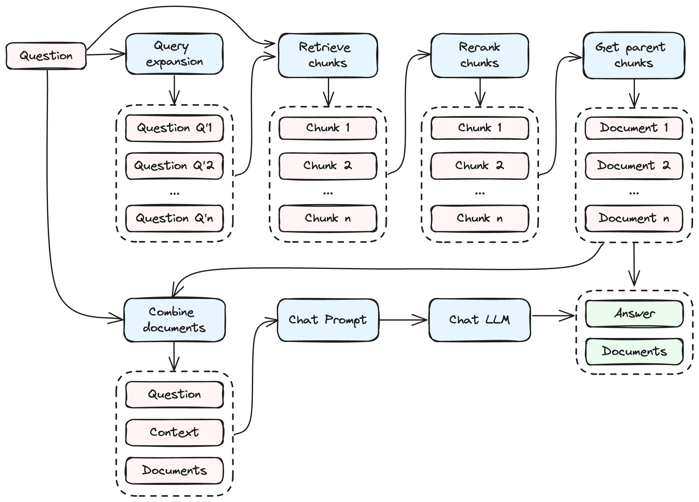

# Chatnerd

A CLI tool for Q&A with your private documents using local LLMs and RAG (Retrieval-augmented generation) techniques. Personal project for learning LLMs and RAGs.

## Table of Contents
- [Chatnerd](#chatnerd)
  - [Table of Contents](#table-of-contents)
  - [Introduction](#introduction)
  - [Requirements](#requirements)
  - [Quick Start](#quick-start)
  - [How to Use?](#how-to-use)
  - [Create and Manage Projects](#create-and-manage-projects)
  - [Add Sources](#add-sources)
  - [Study Documents](#study-documents)
  - [Chat](#chat)
  - [Retrieve and Summarize](#retrieve-and-summarize)
  - [Configuration](#configuration)
  - [Configuration with Environment Variables](#configuration-with-environment-variables)
  - [License](#license)

## Introduction

Chatnerd is a command-line interface (CLI) application to chat with your private documents using local language models (LLMs) and retrieval-augmented generation (RAG) techniques. Each project is designed as an expert in a particular area of knowledge, with its own configuration and set of documents.

Create multiple projects to cover different topics and activate one at a time to focus on that specific area.

## Requirements

Before installing Chatnerd, make sure you have:

- Python >=3.10
- (Optional) OpenAI API key

Install the package:
```bash
pip install git+https://github.com/raulonlab/chatnerd.git
```

For development:
```bash
git clone https://github.com/raulonlab/chatnerd.git
poetry install
poetry shell
```

## Quick Start
```bash
# Install the package or add it to your environment
pip install git+https://github.com/raulonlab/chatnerd.git

# Create and activate a project
chatnerd project create my_first_project
chatnerd project activate my_first_project

# Add some .pdf files to the project's documents directory
cp my_document.pdf _projects/my_first_project/chatnerd_documents/my_document.pdf

# Study documents and start chatting
chatnerd study
chatnerd chat
```

## How to Use?

```bash
chatnerd --help
```

```
 Usage: chatnerd [OPTIONS] COMMAND [ARGS]...                                   
                                                                               
╭─ Options ───────────────────────────────────────────────────────────────────╮
│ --install-completion          Install completion for the current shell.     │
│ --show-completion             Show completion for the current shell, to     │
│                               copy it or customize the installation.        │
│ --help                        Show this message and exit.                   │
╰─────────────────────────────────────────────────────────────────────────────╯
╭─ Commands ──────────────────────────────────────────────────────────────────╮
│ study      Start studying documents (embed and store documents in vector    │
│            DB)                                                              │
│ chat       Start a chat session with your active project                    │
│ retrieve   Retrieve relevant documents of a query and optionally generate a │
│            summary of the documents.                                        │
│ review     Append a review value to the last chat log                       │
│ env        Print the current value of environment variables                 │
│ config     Print the active project configuration (chatnerd.config.yml)     │
│ project    Manage projects: create, activate, deactivate, list and remove   │
│ db         View and manage the local DBs                                    │
╰─────────────────────────────────────────────────────────────────────────────╯
```

## Create and Manage Projects

Create a new project:
```bash
chatnerd project create project_name
```
> The first time, it will create a new directory `_projects` in the current path to store the projects data.

The following files will be created in the projects folder:

```
📁 _projects/
├─ 📁 project_name/
│  ├─ 📁 .nerd_store/            # stores data files (status and vector DBs)
│  ├─ 📁 chatnerd_documents/     # source documents to ingest (pdf, txt, etc)
│  ├─ 📄 chatnerd.models.yml     # Additional LLM presets
│  ├─ 📄 chatnerd.prompts.yml    # Customized prompts
│  ├─ 📄 chatnerd.config.yml     # Customized configuration
```

Manage your projects with these commands:
```bash
chatnerd project activate project_name  # Set as active project
chatnerd project list                   # Show all projects
chatnerd project rename old_name new_name  # Rename project
chatnerd project remove project_name      # Remove project
```

When you activate a project, Chatnerd saves it as `ACTIVE_PROJECT=project_name` in `.chatnerd.env`. All subsequent commands will use this project's configuration and source files.

## Add Sources

Chatnerd can ingest information from these sources:

- **Document files in the directory `chatnerd_documents/`**. The supported formats with the loader class (from Langchain) used are the following:
  - `".pdf"`: PDFMinerLoader,
  - `".epub"`: UnstructuredEPubLoader,
  - `".md"`: UnstructuredMarkdownLoader,
  - `".txt"`: TextLoader,
  - `".doc"`: UnstructuredWordDocumentLoader,
  - `".docx"`: UnstructuredWordDocumentLoader,
  - `".enex"`: EverNoteLoader,
  - `".csv"`: CSVLoader,
  - `".html"`: UnstructuredHTMLLoader,
  - `".odt"`: UnstructuredODTLoader,
  - `".ppt"`: UnstructuredPowerPointLoader,
  - `".pptx"`: UnstructuredPowerPointLoader,

## Study Documents


Start ingesting the documents located in `chatnerd_documents/` (split, calculate embeddings and store in DBs):

```bash
chatnerd study
```
> The command processes documents by storing them in a vector database (either Chroma or Qdrant), with the database files located in the `.nerd_store/` subdirectory within the project's directory. Additionally, the necessary files for the sentence transformer model are automatically downloaded upon the first execution, which may require some time to complete.

For each document, the study process does the following steps:
- Load the document via a Langchain loader.
- Split the document into smaller chunks.
- Apply the sentence transformer model to generate embeddings of these chunks, which are used in the retrieval / similarity searches.
- Store both the chunks and their corresponding embeddings into the vector database.
- Store the original document within a local database called Status DB.

In subsequent runs, documents already processed are automatically excluded.

The embeddings model is loaded using Langchain's `HuggingFaceInstructEmbeddings` or `HuggingFaceEmbeddings` classes. The default model is `hkunlp/instructor-large` and can be changed in the `chatnerd.config.yml` file for the project. 

## Chat



Start an interactive chat session with your active project using the command line:
```bash
chatnerd chat
```

Alternatively, you can send a one-off question passing it as an argument:
```bash
chatnerd chat "..."
```
> Note: The first time you use a new LLM model, the necessary model files will be downloaded, which may take some time.

The LLM model for completions is configurable in the project's `chatnerd.config.yml` file (Further details are covered in subsequent sections). The default model is mistral-7b-instruct-v0.1-gguf:

```yaml
mistral-7b-instruct-v0.1-gguf:
  provider: llamacpp
  prompt_type: mistral
  model_id: TheBloke/Mistral-7B-Instruct-v0.1-GGUF
  model_basename: mistral-7b-instruct-v0.1.Q4_K_M.gguf
  temperature: 0.2
  # top_p: 0.95
  n_ctx: 16000
  max_tokens: 8192
  n_batch: 512  # Adjust based on your GPU & CPU RAM capacity (Default: 8)
  n_gpu_layers: -1
```

The `provider` property indicates the component that provides the model. Available providers include:
- `llamacpp`: (Default if not present) HuggingFace model using Langchain's `LlamaCpp` class (package `llama-cpp-python`)
- `ollama`: Ollama server using Langchain's `ChatOllama` or `Ollama` classes.
- `openai`: OpenAI server using Langchain's `ChatOpenAI` or `OpenAI` classes. The `base_url` can be set to point to APIs providing the same interface than OpenAI

> All defined properties (e.g., temperature, max_tokens) will be forwarded to the selected provider class.

The `prompt_type` property sets the formatting of the prompts according to the model's architecture, with available options being:

- `llama`: Specific Llama prompt syntax. Use it with provider `llamacpp` and a llama/llama2 type model
- `mistral`: Specific Mistral prompt syntax. Use it with provider `llamacpp` and a mistral type model
- `None` (or unset): No prompt formatting. Suitable for `ollama` and `openai` providers.

Finally, you can adjust the behaviour of the chain in the section `chat_chain` of the config file. Some of the parameters are:
- `n_expanded_questions`: Number of similar questions to expand the original query with. Set 0 to disable query expansion. (Default: 3)
- `use_cross_encoding_rerank`: Enable / disable cross-encoding reranking of retrieved documents. (Default: true)
- `n_combined_documents`: Number of documents to retrieve and to combine as a context in the chat prompt sent to the LLM. (Default: 6)

## Retrieve and Summarize


If you only want to retrieve the most relevant documents related with a given query, run the command::
```bash
chatnerd retrieve
```

And optionally generate and display a summary of the retrieved documents:
```bash
chatnerd retrieve --summary
```

You can adjust the behaviour of the chain and the summary in the sections `retrieve_chain` and `summarize` of the config file. 

## Configuration

Display the project's current configuration with the command:
```bash
chatnerd config
```

You can customize the behaviour of the project by editing the `chatnerd.config.yml` file in the project directory. The default settings used by the project are defined in [chatnerd/chatnerd.config.yml](chatnerd/chatnerd.config.yml). Changes to the configuration take effect immediately with each command execution.

> Important: Changes to certain settings, such as `embeddings` and `vector_store`, will invalidate the existing embeddings in the vector store. To address this, remove the `.nerd_store` directory and run `chatnerd study` again.

There exists 2 additional config files that can be customized:
- `chatnerd.models.yml`: Add custom model presets available to your project. See initial presets in [chatnerd/chatnerd.models.yml](https://github.com/raulonlab/chatnerd/blob/main/chatnerd/chatnerd.models.yml) or run `chatnerd config models` to see the complete list.
- `chatnerd.prompts.yml`: Change the prompts used by the project. See default prompts in [chatnerd/chatnerd.prompts.yml](https://github.com/raulonlab/chatnerd/blob/main/chatnerd/chatnerd.prompts.yml) or run `chatnerd config prompts` to see the active ones.

## Configuration with Environment Variables

You can adjust the application's general behavior using environment variables, either directly or by specifying them in an optional `.env` file located in the current directory.

To view the current set of environment variables, use the command:
```bash
chatnerd env
```

The available variables with their default values are:

```ini
# general options
PROJECTS_DIRECTORY_PATH=_projects  # (Default: "_projects") Path to projects directory
LOG_FILE_LEVEL=  # (Default: None) Logging level for the log file. Values: INFO, WARNING, ERROR, CRITICAL, NOTSET. If None, disable logging to file
LOG_FILE_PATH=logs/chatnerd.log  # (Default: "logs/chatnerd.log") Path to log file
VERBOSE=1  # (Default: 1) Amount of logs written to stdout (0: none, 1: medium, 2: full)

# openai
OPENAI_API_KEY=  # (Default: None) OpenAI API key. If None, disable OpenAI integration
```

The application also stores runtime settings in the `.chatnerd.env` file, such as the active project configuration. It's not necessary to touch this file, as it is handled automatically by the application.

## License

This project is licensed under the MIT License. See the [LICENSE](LICENSE) file for details.

